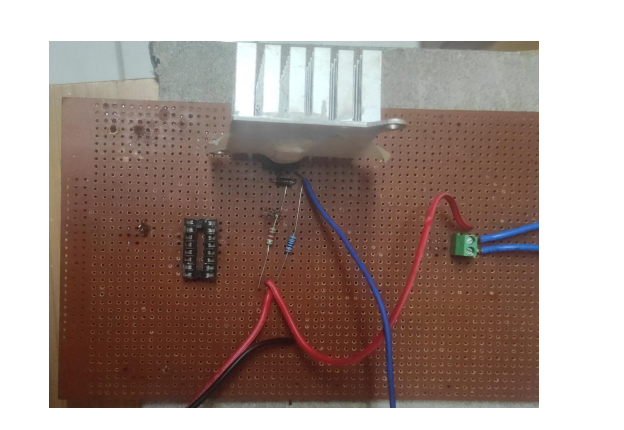
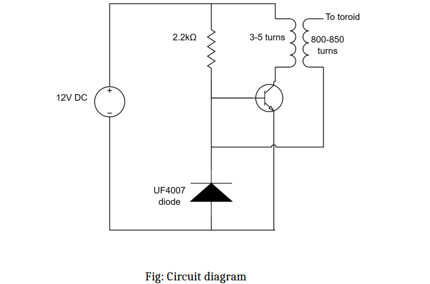
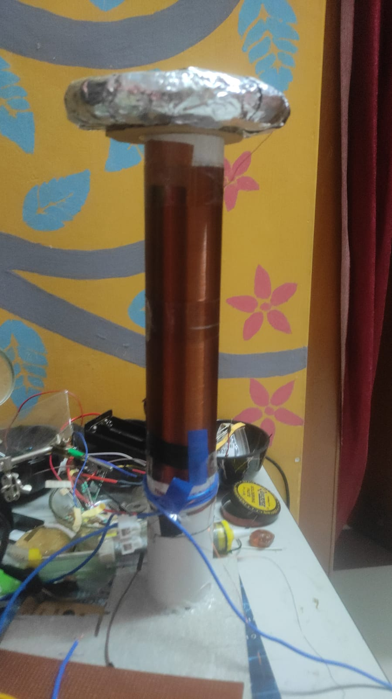

# Solid-State Tesla Coil for Electromagnetic Interference Demonstration

 ## Overview

This project presents the design and implementation of a Solid-State Tesla Coil (Slayer Exciter) powered by a 12 V DC supply. It demonstrates resonant inductive coupling, high-voltage generation, transistor-based oscillation, and electromagnetic interference (EMI), providing practical exposure to analog electronics, power electronics, and electromagnetic field concepts.

## Objectives

- Design a Solid-State Tesla Coil using a Slayer Exciter topology.
- Demonstrate resonant inductive coupling.
- Generate high-frequency, high-voltage electric fields.
- Understand practical aspects of EMI and EMC.
- Develop hardware prototyping and circuit debugging skills.

## Components Used

 Component 

 12 V DC Adapter , 
BD139 -  Switching Transistor ,
UF4007 - Protection Diode ,
2.2 kΩ Resistor - Base Bias ,
 Primary Coil - Magnetic Field Generation ,
 Secondary Coil - High Voltage Generation ,
 PVC Pipe - Coil Former ,
 Aluminium Foil - Capacitive Top Load ,
 Heat Sink - Thermal Management ,

## Working Principle

1. The 12 V DC supply powers the circuit.
2. The BD139 transistor receives base current through the resistor.
3. Current flowing through the primary winding creates a changing magnetic field.
4. The secondary winding induces a high voltage through electromagnetic induction.
5. Positive feedback sustains self-oscillation at the resonant frequency.
6. The aluminium foil top load stores charge and produces a high-frequency electric field.

## Engineering Concepts

- Electromagnetic Induction
- Transformer Action
- Resonant Circuits
- Analog Electronics
- Power Electronics
- Electromagnetic Interference (EMI)
- Electromagnetic Compatibility (EMC)
- Hardware Prototyping

## Project Images

### Final Setup

### Circuit Diagram

## Final Setup

## Future Improvements

- MOSFET-based driver circuit
- Current limiting protection
- Toroidal top load
- Frequency tuning

